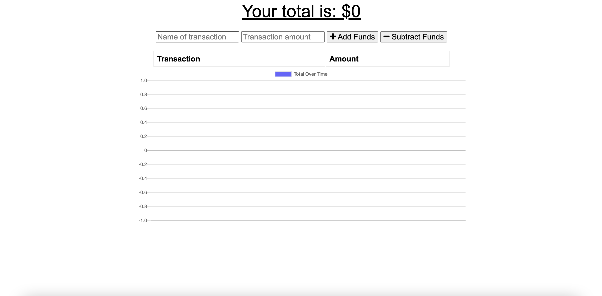

# Budget Tracker

## Table of Contents

- [Description](#description)
- [User Story](#user-story)
- [Acceptance Criteria](#acceptance-criteria)
- [Installation](#installation)
- [Usage](#usage)
- [Contribution](#contribution)
- [Questions](#questions)

## Description

This application is a budget tracker. I have updated this website to be able to be used offline. When you are brought back online, the changes you made while offline will be updated.

## User Story

```md
AS AN avid traveller
I WANT to be able to track my withdrawals and deposits with or without a data/internet connection
SO THAT my account balance is accurate when I am traveling
```

## Acceptance Criteria

```md
GIVEN a Budget Tracker without an internet connection
WHEN the user inputs an expense or deposit
THEN they will receive a notification that they have added an expense or deposit
WHEN the user reestablishes an internet connection
THEN the deposits or expenses added while they were offline are added to their transaction history and their totals are updated
```

## Installation

```md
npm i
```

## Usage



Deployed URL: https://secure-mountain-37084.herokuapp.com/

GitHub Repo: https://github.com/Theresa2013/budget-tracker.git

## Contribution

If you are interested in future development, please reach me via email or Github!

## Questions

If you have any questions, please feel free to reach out!

Github username: Theresa2013

Github Email: tab61295@gmail.com
